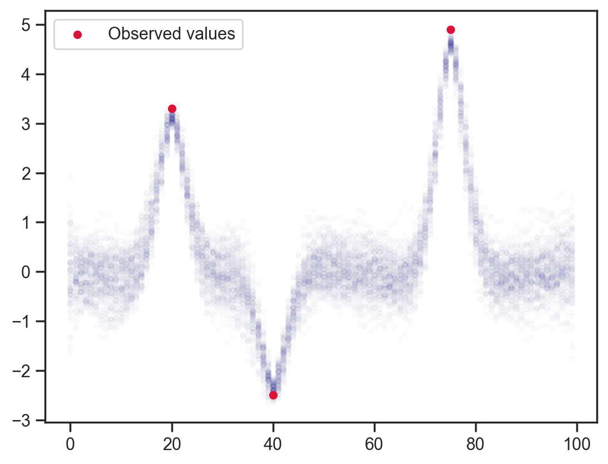
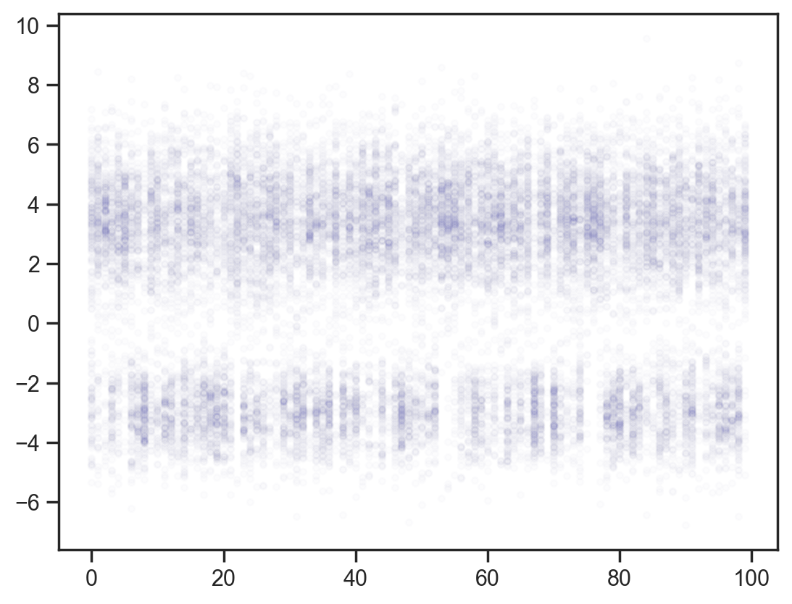

# Simple generation of locally constrained values in `numpyro`

Just a simple experiment using `numpyro` to simulate values from a function with locally constrained values. This is often achieved using Gaussian processed but I thought it would be interesting to try something a bit more intuitive, plus priors on the points themselves and their interdependence can be anything, not just normal distributions.


```python
import jax
import jax.numpy as jnp
import matplotlib.pyplot as plt
import numpy as np
import numpyro.distributions as dist
import seaborn as sns
from numpyro import sample
from numpyro.infer import MCMC, NUTS

sns.set_theme('notebook', 'ticks', font='Arial')

plt.rcParams['figure.dpi'] = 200
```

First, baseline: Independent draws from a normal distribution.


```python
def model1():
    x = sample("x", dist.Normal().expand([100]))


mcmc = MCMC(NUTS(model1), num_warmup=1000, num_samples=100)
mcmc.run(jax.random.PRNGKey(0))
samples = mcmc.get_samples()

x_points = np.repeat(np.arange(100)[None, :], samples["x"].shape[0], axis=0)
plt.scatter(
    x_points.flatten(), samples["x"].flatten(), color="darkblue", alpha=0.01, s=10
)
plt.gca().set(xlabel="Spatial/temporal dimension", ylabel="Observable");
```

    sample: 100%|██████████| 1100/1100 [00:00<00:00, 1656.79it/s, 7 steps of size 4.46e-01. acc. prob=0.86]


    

    


Adding some point observations ...


```python
obs_vals = jnp.array([3.3, -2.5, 4.9])
obs_idx = jnp.array([20, 40, 75])

def model2(obs_vals, obs_idx):
    x = sample('x', dist.Normal().expand([100]))
    sample('x_point_obs', dist.Normal(loc=obs_vals, scale=0.1), obs=x[obs_idx])


mcmc = MCMC(NUTS(model2), num_warmup=1000, num_samples=100)
mcmc.run(jax.random.PRNGKey(0), obs_vals, obs_idx)
samples = mcmc.get_samples()

plt.scatter(x_points.flatten(), samples['x'].flatten(), color='darkblue', alpha=0.01, s=10);
plt.scatter(obs_idx, obs_vals, label='Observed values', color='crimson', s=20)
plt.legend();
```

    sample: 100%|██████████| 1100/1100 [00:00<00:00, 1624.28it/s, 15 steps of size 4.02e-01. acc. prob=0.90]


    

    


"Observing" each point to be the average of previous and following points. This would be equivalent to adjusting the log-likelihood or adding a potential in other packages.


```python
def model3(obs_vals, obs_idx):
    x = sample('x', dist.Normal().expand([100]))
    sample('x_dependence', dist.Normal(loc=(x[:-2]+x[2:])/2.0, scale=0.1), obs=x[1:-1])
    sample('x_point_obs', dist.Normal(loc=obs_vals, scale=0.1), obs=x[obs_idx])


mcmc = MCMC(NUTS(model3), num_warmup=1000, num_samples=100)
mcmc.run(jax.random.PRNGKey(0), obs_vals, obs_idx)
samples = mcmc.get_samples()

plt.scatter(x_points.flatten(), samples['x'].flatten(), color='darkblue', alpha=0.01, s=10)
plt.scatter(obs_idx, obs_vals, label='Observed values', color='crimson', s=20)
plt.legend();
```

    sample: 100%|██████████| 1100/1100 [00:01<00:00, 903.87it/s, 63 steps of size 8.62e-02. acc. prob=0.84] 


    

    


Slightly fancier — weighted relation to next/previous 2 points. I don't notice a dramatic change with this 1:2:2:1 weighting but it would be interesting to add asymmetric constraints, etc. I suppose this could be useful for probabilistic low-pass filtering with sinc weights.


```python
def model4(obs_vals, obs_idx):
    x = sample('x', dist.Normal().expand([100]))
    sample('x_pre_obs', dist.Normal(loc=(x[:-4]+2.0*x[1:-3]+2.0*x[3:-1]+x[4:])/6.0, scale=0.1), obs=x[2:-2])
    sample('x_point_obs', dist.Normal(loc=obs_vals, scale=0.1), obs=x[obs_idx])


mcmc = MCMC(NUTS(model4), num_warmup=1000, num_samples=100)
mcmc.run(jax.random.PRNGKey(0), obs_vals, obs_idx)
samples = mcmc.get_samples()

plt.plot(samples['x'].T, color='darkblue', alpha=0.01)
plt.scatter(obs_idx, obs_vals, label='Observed values', color='crimson', s=20)
plt.legend();
```

    sample: 100%|██████████| 1100/1100 [00:01<00:00, 1011.04it/s, 63 steps of size 9.88e-02. acc. prob=0.89]


    

    


Something a bit more interesting. Let's change the "base" distribution to be bimodal and asymmetric. I have picked fairly broad humps so we have a fair shot at achieving good mixing.


```python
mixing_distribution = dist.Categorical(jnp.array([0.3, 0.7]))
component_distribution = dist.Normal(
    loc=jnp.array([-3.0, 3.5]), scale=jnp.array([1.0, 1.5])
)

d = dist.MixtureSameFamily(mixing_distribution, component_distribution)

x = jnp.linspace(-10, 10, 200)
y = np.exp(d.log_prob(x))

plt.fill_between(x, y, alpha=0.3, color='darkblue')
plt.gca().set(xlabel='x', ylabel='PDF');
```


    

    


```python
def model5(obs_vals, obs_idx):
    x = sample('x', d.expand([100]))

mcmc = MCMC(NUTS(model5), num_warmup=1000, num_samples=200)
mcmc.run(jax.random.PRNGKey(0), obs_vals, obs_idx)
samples = mcmc.get_samples()

x_points = np.repeat(np.arange(100)[None, :], samples['x'].shape[0], axis=0)
plt.scatter(x_points.flatten(), samples['x'].flatten(), color='darkblue', alpha=0.01, s=10);
```

    sample: 100%|██████████| 1200/1200 [00:00<00:00, 1610.28it/s, 15 steps of size 1.68e-01. acc. prob=0.83]


    

    


Adding back the observation constraints without dependence.


```python
def model6(obs_vals, obs_idx):
    x = sample('x', d.expand([100]))
    sample('x_point_obs', dist.Normal(loc=obs_vals, scale=0.1), obs=x[obs_idx])

mcmc = MCMC(NUTS(model6), num_warmup=1000, num_samples=200)
mcmc.run(jax.random.PRNGKey(0), obs_vals, obs_idx)
samples = mcmc.get_samples()

x_points = np.repeat(np.arange(100)[None, :], samples['x'].shape[0], axis=0)
plt.scatter(x_points.flatten(), samples['x'].flatten(), color='darkblue', alpha=0.01, s=10)
plt.scatter(obs_idx, obs_vals, label='Observed values', color='crimson', s=20)
plt.legend();
```

    sample: 100%|██████████| 1200/1200 [00:00<00:00, 1463.46it/s, 15 steps of size 1.48e-01. acc. prob=0.87]


    

    


Finally, bringing back dependency on adjacent points ...


```python
def model6(obs_vals, obs_idx):
    x = sample('x', d.expand([100]))
    sample('x_dependence', dist.Normal(loc=(x[:-2]+x[2:])/2.0, scale=0.1), obs=x[1:-1])
    sample('x_point_obs', dist.Normal(loc=obs_vals, scale=0.1), obs=x[obs_idx])

mcmc = MCMC(NUTS(model6), num_warmup=1000, num_samples=200)
mcmc.run(jax.random.PRNGKey(0), obs_vals, obs_idx)
samples = mcmc.get_samples()

x_points = np.repeat(np.arange(100)[None, :], samples['x'].shape[0], axis=0)
# plt.scatter(x_points.flatten(), samples['x'].flatten(), color='darkblue', alpha=0.01, s=10)
plt.scatter(obs_idx, obs_vals, label='Observed values', color='crimson', s=20, zorder=10)
plt.plot(samples['x'].T, color='darkblue', alpha=0.01)
plt.legend();
```

    sample: 100%|██████████| 1200/1200 [00:03<00:00, 356.29it/s, 255 steps of size 2.30e-02. acc. prob=0.88]


    

    


And now just for fun, let's try a bimodal dependency distribution, here essentially saying that each point is likely to be larger than its neighbor (or linger in the same ballpark).


```python
d_dep = dist.MixtureSameFamily(
    mixing_distribution,
    dist.Normal(loc=jnp.array([0, 0.5]), scale=0.1)
)

x = jnp.linspace(-1, 1, 200)
y = np.exp(d_dep.log_prob(x))

plt.fill_between(x, y, alpha=0.3, color='darkblue')
plt.gca().set(xlabel='x', ylabel='PDF', title='$x_i - x_{i-1}$ prior');
```


    

    


```python
def model7(obs_vals, obs_idx):
    x = sample('x', d.expand([100]))
    sample('x_dependence', d_dep, obs=x[1:] - x[:-1])

mcmc = MCMC(NUTS(model7), num_warmup=1000, num_samples=200)
mcmc.run(jax.random.PRNGKey(0), obs_vals, obs_idx)
samples = mcmc.get_samples()

plt.scatter(x_points.flatten(), samples['x'].flatten(), color='darkblue', alpha=0.01, s=10)
plt.plot(x_points[0], samples['x'].mean(axis=0), color='crimson', lw=2, label='Mean')
plt.legend();
```

    sample: 100%|██████████| 1200/1200 [00:03<00:00, 396.09it/s, 127 steps of size 6.49e-02. acc. prob=0.84]


    

    


With the observations added back in you can see how the function finds it easier to catch up with sudden rises than falls due to the prior on adjacent values.


```python
def model8(obs_vals, obs_idx):
    x = sample('x', d.expand([100]))
    sample('x_dependence', d_dep, obs=x[1:] - x[:-1])
    sample('x_point_obs', dist.Normal(loc=obs_vals, scale=0.25), obs=x[obs_idx])

mcmc = MCMC(NUTS(model8), num_warmup=1000, num_samples=200)
mcmc.run(jax.random.PRNGKey(0), obs_vals, obs_idx)
samples = mcmc.get_samples()

plt.scatter(x_points.flatten(), samples['x'].flatten(), color='darkblue', alpha=0.01, s=10)
plt.plot(x_points[0], samples['x'].mean(axis=0), color='crimson', lw=2, label='Mean')
plt.scatter(obs_idx, obs_vals, label='Observed values', color='crimson', s=20)
plt.legend();
```

    sample: 100%|██████████| 1200/1200 [00:02<00:00, 497.90it/s, 255 steps of size 5.76e-02. acc. prob=0.88]


    

    


Very cool and I think quite useful for modelling chromatograms.
