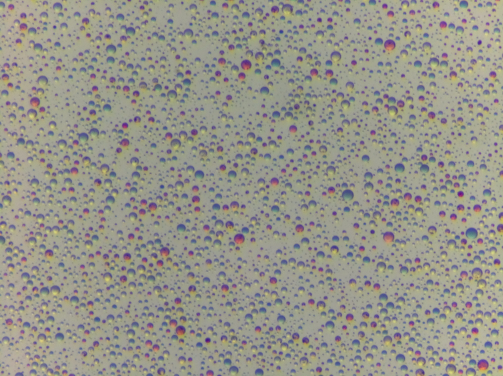
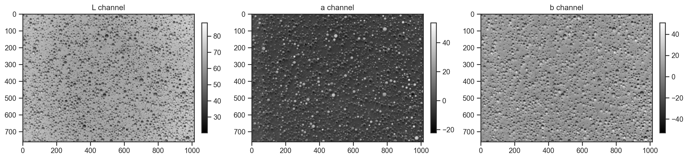
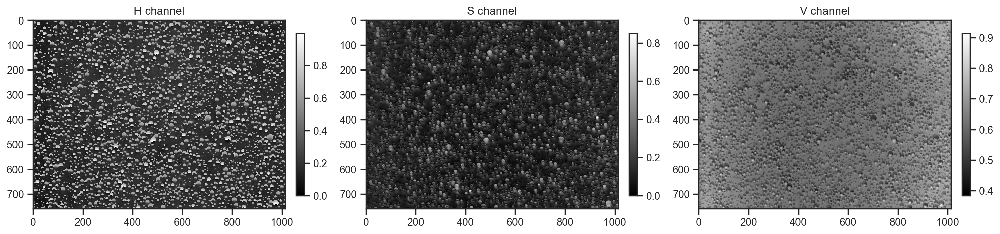
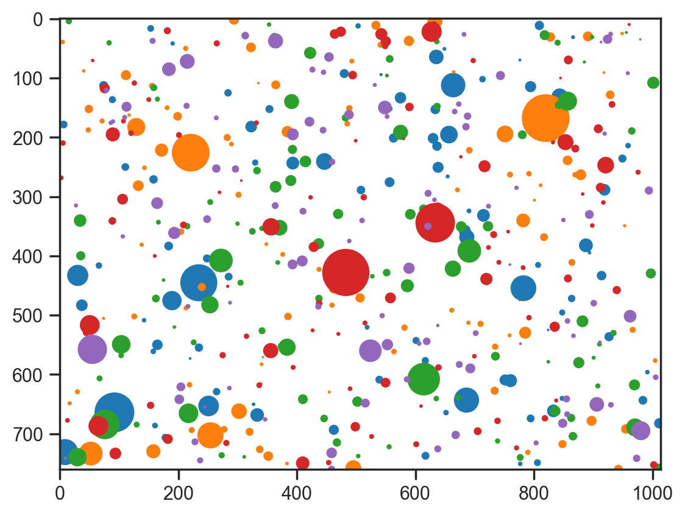
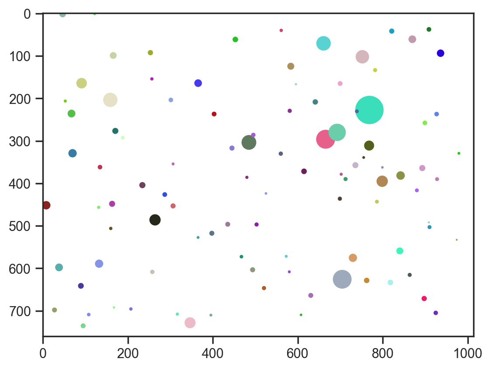
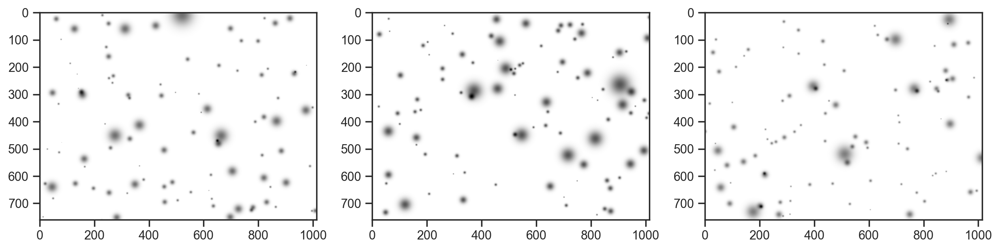
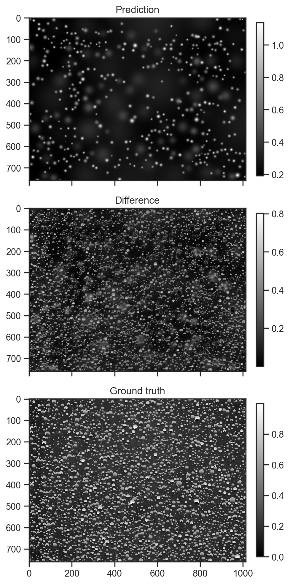
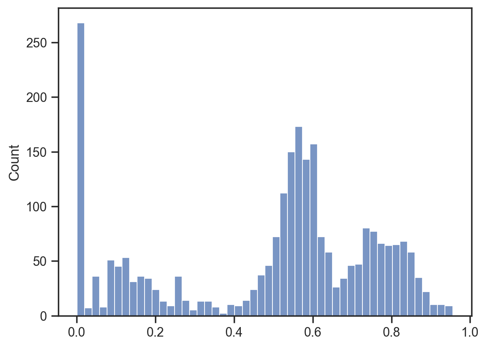

# Trialing generative processes for chemical microscopy (part 1)

Is it possible to use a generative process to model microscope images like this (and is it worth the effort?)


```python
import jax
import jax.numpy as jnp
import matplotlib.pyplot as plt
import numpy as np
import numpyro.distributions as dist
import seaborn as sns
from numpyro import deterministic, plate, sample
from numpyro.infer import MCMC, NUTS, SVI, Trace_ELBO
from numpyro.infer.autoguide import AutoNormal
from numpyro.optim import Adam
from PIL import Image

sns.set_theme('notebook', 'ticks', font='Arial')

plt.rcParams['figure.dpi'] = 200
```


```python
img = Image.open('data/example.jpg')
img = img.resize((img.width // 2, img.height // 2))
img
```


    

    


Try a couple of different colour spaces in case something interesting stands out.


```python
from skimage import color

img_array = np.array(img)
lab_img = color.rgb2lab(img_array)

fig, axes = plt.subplots(3, 1, figsize=(5, 10), sharex=True)

for i, (ax, title) in enumerate(zip(axes, ['L channel', 'a channel', 'b channel'])):
    im = ax.imshow(lab_img[:,:,i], cmap='gray')
    ax.set_title(title)
    fig.colorbar(im, ax=ax, fraction=0.03, pad=0.04)

plt.tight_layout()
```


    

    


```python
hsv_img = color.rgb2hsv(img_array)

fig, axes = plt.subplots(3, 1, figsize=(5, 10), sharex=True)

for i, (ax, title) in enumerate(zip(axes, ['H channel', 'S channel', 'V channel'])):
    im = ax.imshow(hsv_img[:,:,i], cmap='gray')
    ax.set_title(title)
    fig.colorbar(im, ax=ax, fraction=0.03, pad=0.04)

plt.tight_layout()
```


    

    


First approach, fixed number of droplets; model centres and radii


```python
def model1(w, h, n_droplets):
    with plate("droplets", n_droplets):
        x = sample("x", dist.Uniform(0, w))
        y = sample("y", dist.Uniform(0, h))
        r = sample("r", dist.LogNormal(1.5, 0.75))


mcmc = MCMC(NUTS(model1), num_warmup=1000, num_samples=100)
mcmc.run(jax.random.PRNGKey(0), w=img.width, h=img.height, n_droplets=100)
samples = mcmc.get_samples()

fig, ax = plt.subplots()
ax.imshow(np.ones_like(np.array(img)) * 255, cmap="gray")
for sample_no in range(5):
    for i in range(100):
        circle = plt.Circle(
            (samples["x"][sample_no][i], samples["y"][sample_no][i]),
            samples["r"][sample_no][i],
            color=plt.cm.tab10(sample_no),
        )

        ax.add_artist(circle)
```

    sample: 100%|██████████| 1100/1100 [00:09<00:00, 112.09it/s, 15 steps of size 3.08e-01. acc. prob=0.84]


    

    


```python
def model2(w, h, n_droplets):
    # Sample droplet locations and sizes
    with plate("droplets", n_droplets):
        x = sample("x", dist.Uniform(0, w))
        y = sample("y", dist.Uniform(0, h))
        r = sample("r", dist.LogNormal(1.5, 0.75))
        
        # Sample HSV values for each droplet
        h_val = sample("h", dist.Uniform(0, 1))
        s_val = sample("s", dist.Beta(2, 2))
        v_val = sample("v", dist.Beta(5, 2))  # Biased towards brighter values

mcmc = MCMC(NUTS(model2), num_warmup=1000, num_samples=100)
mcmc.run(jax.random.PRNGKey(0), w=img.width, h=img.height, n_droplets=100)
samples = mcmc.get_samples()
samples = {k: np.array(v) for k, v in samples.items()}

# Visualize with HSV colors
fig, ax = plt.subplots()
ax.imshow(np.ones_like(np.array(img)) * 255, cmap="gray")
for i in range(100):
    circle = plt.Circle(
        (samples["x"][0][i], samples["y"][0][i]),
        samples["r"][0][i],
        color=color.hsv2rgb(
            np.array(
                [
                    samples["h"][0][i],
                    samples["s"][0][i],
                    samples["v"][0][i],
                ]
            )
        ),
    )
    ax.add_artist(circle)
```

    sample: 100%|██████████| 1100/1100 [00:14<00:00, 74.39it/s, 15 steps of size 2.52e-01. acc. prob=0.86] 


    

    


```python
def model2(w, h, n_droplets):
    # Sample droplet locations and sizes
    with plate("droplets", n_droplets):
        x = sample("x", dist.Uniform(0, w))
        y = sample("y", dist.Uniform(0, h))
        r = sample("r", dist.LogNormal(1.5, 0.75))
        
        with plate("pixels", w * h):
            x_dist = jnp.abs(x - jnp.arange(w)[:, None])
            y_dist = jnp.abs(y - jnp.arange(h)[:, None])
            distance = jnp.sqrt(x_dist ** 2 + y_dist[:, None] ** 2)
            val = deterministic('val', jnp.sum(jnp.exp(-distance ** 2 / (2 * r ** 2)), axis=-1))


mcmc = MCMC(NUTS(model2), num_warmup=500, num_samples=10)
mcmc.run(jax.random.PRNGKey(0), w=img.width, h=img.height, n_droplets=100)
samples = mcmc.get_samples()
samples = {k: np.array(v) for k, v in samples.items()}

# show the first 3 samples
fig, axes = plt.subplots(3, 1, figsize=(5, 10), sharex=True)
for i, ax in enumerate(axes):
    ax.imshow(1 - samples['val'][i], cmap='gray')
```

    sample: 100%|██████████| 510/510 [00:06<00:00, 78.12it/s, 15 steps of size 3.10e-01. acc. prob=0.85] 


    

    


Not a bad generative process to start with. Now let's just fit the hue channel ...


```python
def model3(w, h, n_droplets, channel, error_scale):
    # Sample droplet locations and sizes
    bg = sample("bg", dist.Uniform(0, 1))
    with plate("droplets", n_droplets):
        x = sample("x", dist.Uniform(0, 1))*w
        y = sample("y", dist.Uniform(0, 1))*h
        r = sample("r", dist.LogNormal(1.5, 0.75))
        amplitude = sample("amplitude", dist.Uniform(0, 1))
        
        x_dist = jnp.abs(x - jnp.arange(w)[:, None])
        y_dist = jnp.abs(y - jnp.arange(h)[:, None])
        distance = jnp.sqrt(x_dist ** 2 + y_dist[:, None] ** 2)
        val = deterministic('val', bg + jnp.sum(amplitude[None, None, :] * jnp.exp(-distance ** 2 / (2 * r ** 2)), axis=-1))
        diff = deterministic('diff', val - channel)
    sample('obs', dist.Normal(0, error_scale), obs=val - channel)

```

Fitting, instead of sampling


```python
guide = AutoNormal(model3)
svi = SVI(model3, guide, Adam(0.01), Trace_ELBO())
svi_result = svi.run(jax.random.PRNGKey(0), 20000, img.width, img.height, 500, hsv_img[:,:,0], 0.05)
```

    100%|██████████| 20000/20000 [04:40<00:00, 71.43it/s, init loss: 19718028.0000, avg. loss [19001-20000]: 5279295.0000]


```python
svi_result = svi.run(jax.random.PRNGKey(0), 50000, img.width, img.height, 500, hsv_img[:,:,0], 0.05, init_state=svi_result.state)
```

      0%|          | 0/50000 [00:00<?, ?it/s]

    100%|██████████| 50000/50000 [11:36<00:00, 71.82it/s, init loss: 5101927.5000, avg. loss [47501-50000]: 5046932.5000]


```python
samples = guide.sample_posterior(jax.random.PRNGKey(0), svi_result.params, sample_shape=(5,))
```


```python
fig, axes = plt.subplots(3, 1, figsize=(5, 10), sharex=True)
fig.colorbar(axes[0].imshow(samples['val'][0], cmap='gray'), ax=axes[0], fraction=0.03, pad=0.04)
axes[0].set_title('Prediction')
fig.colorbar(axes[1].imshow(jnp.abs(samples['diff'][0]), cmap='gray'), ax=axes[1], fraction=0.03, pad=0.04)
axes[1].set_title('Difference')
fig.colorbar(axes[-1].imshow(hsv_img[:,:,0], cmap='gray'), ax=axes[-1], fraction=0.03, pad=0.04)
axes[-1].set_title('Ground truth')
fig.tight_layout()
```


    

    


Not a bad start. Most of the brightests spots have been fitted. I am surprised thought that a lot of the amplitudes are almost zero. At the end of the day, optimisations where pieces have to move into the right place first are tricky and I have no reason to believe that this is a global optimum, despite having spent a while trying to tease out a better outcome.


```python
sns.histplot(samples['amplitude'].flatten(), bins=50);
```


    

    

