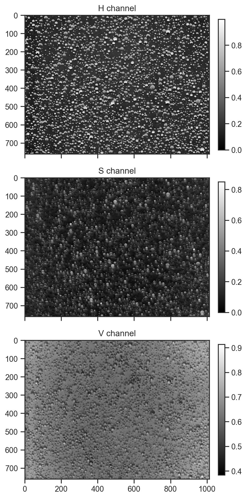

```python
import jax
import jax.numpy as jnp
import matplotlib.pyplot as plt
import numpy as np
import numpyro.distributions as dist
import seaborn as sns
from jax.scipy.special import bessel_jn
from numpyro import deterministic, plate, sample
from numpyro.handlers import seed, substitute, trace
from numpyro.infer import MCMC, NUTS
from PIL import Image

sns.set_theme('notebook', 'ticks', font='Arial')

plt.rcParams['figure.dpi'] = 200
```

# Trialing generative processes for chemical microscopy

Is it possible to use a generative process to model microscope images like this (and is it worth the effort?)


```python
img = Image.open('data/example.jpg')
img = img.resize((img.width // 2, img.height // 2))
```

Try a couple of different colour spaces in case something interesting stands out.


```python
from skimage import color

img_array = np.array(img)
lab_img = color.rgb2lab(img_array)

fig, axes = plt.subplots(1, 3, figsize=(15, 5))

for i, (ax, title) in enumerate(zip(axes, ['L channel', 'a channel', 'b channel'])):
    im = ax.imshow(lab_img[:,:,i], cmap='gray')
    ax.set_title(title)
    fig.colorbar(im, ax=ax, fraction=0.03, pad=0.04)

plt.tight_layout()
```


    

    


```python
hsv_img = color.rgb2hsv(img_array)

fig, axes = plt.subplots(1, 3, figsize=(15, 5))

for i, (ax, title) in enumerate(zip(axes, ['H channel', 'S channel', 'V channel'])):
    im = ax.imshow(hsv_img[:,:,i], cmap='gray')
    ax.set_title(title)
    fig.colorbar(im, ax=ax, fraction=0.03, pad=0.04)

plt.tight_layout()
```


    

    


First approach, fixed number of droplets; model centres and radii


```python
def model1(w, h, n_droplets):
    with plate("droplets", n_droplets):
        x = sample("x", dist.Uniform(0, w))
        y = sample("y", dist.Uniform(0, h))
        r = sample("r", dist.LogNormal(1.5, 0.75))


mcmc = MCMC(NUTS(model1), num_warmup=1000, num_samples=100)
mcmc.run(jax.random.PRNGKey(0), w=img.width, h=img.height, n_droplets=100)
samples = mcmc.get_samples()

fig, ax = plt.subplots()
ax.imshow(np.ones_like(np.array(img)) * 255, cmap="gray")
for sample_no in range(5):
    for i in range(100):
        circle = plt.Circle(
            (samples["x"][sample_no][i], samples["y"][sample_no][i]),
            samples["r"][sample_no][i],
            color=plt.cm.tab10(sample_no),
        )

        ax.add_artist(circle)
```

    sample: 100%|██████████| 1100/1100 [00:00<00:00, 1106.20it/s, 15 steps of size 3.18e-01. acc. prob=0.84]


    

    


```python
def model2(w, h, n_droplets):
    # Sample droplet locations and sizes
    with plate("droplets", n_droplets):
        x = sample("x", dist.Uniform(0, w))
        y = sample("y", dist.Uniform(0, h))
        r = sample("r", dist.LogNormal(1.5, 0.75))
        
        # Sample HSV values for each droplet
        h_val = sample("h", dist.Uniform(0, 1))
        s_val = sample("s", dist.Beta(2, 2))
        v_val = sample("v", dist.Beta(5, 2))  # Biased towards brighter values

mcmc = MCMC(NUTS(model2), num_warmup=1000, num_samples=100)
mcmc.run(jax.random.PRNGKey(0), w=img.width, h=img.height, n_droplets=100)
samples = mcmc.get_samples()
samples = {k: np.array(v) for k, v in samples.items()}

# Visualize with HSV colors
fig, ax = plt.subplots()
ax.imshow(np.ones_like(np.array(img)) * 255, cmap="gray")
for i in range(100):
    circle = plt.Circle(
        (samples["x"][0][i], samples["y"][0][i]),
        samples["r"][0][i],
        color=color.hsv2rgb(
            np.array(
                [
                    samples["h"][0][i],
                    samples["s"][0][i],
                    samples["v"][0][i],
                ]
            )
        ),
    )
    ax.add_artist(circle)
```

    sample: 100%|██████████| 1100/1100 [00:01<00:00, 668.27it/s, 15 steps of size 2.67e-01. acc. prob=0.84]


    

    


```python
def model2(w, h, n_droplets):
    # Sample droplet locations and sizes
    with plate("droplets", n_droplets):
        x = sample("x", dist.Uniform(0, w))
        y = sample("y", dist.Uniform(0, h))
        r = sample("r", dist.LogNormal(1.5, 0.75))
        
        with plate("pixels", w * h):
            x_dist = jnp.abs(x - jnp.arange(w)[:, None])
            y_dist = jnp.abs(y - jnp.arange(h)[:, None])
            distance = jnp.sqrt(x_dist ** 2 + y_dist[:, None] ** 2)
            val = deterministic('val', jnp.sum(jnp.exp(-distance ** 2 / (2 * r ** 2)), axis=-1))


mcmc = MCMC(NUTS(model2), num_warmup=500, num_samples=10)
mcmc.run(jax.random.PRNGKey(0), w=img.width, h=img.height, n_droplets=100)
samples = mcmc.get_samples()
samples = {k: np.array(v) for k, v in samples.items()}

# show the first 3 samples
fig, axes = plt.subplots(1, 3, figsize=(15, 5))
for i, ax in enumerate(axes):
    ax.imshow(1 - samples['val'][i], cmap='gray')
```

    sample: 100%|██████████| 510/510 [00:28<00:00, 17.91it/s, 15 steps of size 3.16e-01. acc. prob=0.85]


    

    


Not a bad generative process to start with. Now let's just fit the hue channel ...


```python
def model3(w, h, n_droplets, channel):
    # Sample droplet locations and sizes
    bg = sample("bg", dist.Uniform(0, 1))
    with plate("droplets", n_droplets):
        x = sample("x", dist.Uniform(0, w))
        y = sample("y", dist.Uniform(0, h))
        r = sample("r", dist.LogNormal(1.5, 0.75))
        amplitude = sample("amplitude", dist.Normal())
        
        x_dist = jnp.abs(x - jnp.arange(w)[:, None])
        y_dist = jnp.abs(y - jnp.arange(h)[:, None])
        distance = jnp.sqrt(x_dist ** 2 + y_dist[:, None] ** 2)
        val = deterministic('val', bg + jnp.sum(amplitude[None, None, :] * jnp.exp(-distance ** 2 / (2 * r ** 2)), axis=-1))
        diff = deterministic('diff', val - channel)
    sample('obs', dist.Normal(0, 1.0), obs=val - channel)

with seed(rng_seed=0):
    model_trace = trace(model3).get_trace(w=img.width, h=img.height, n_droplets=100, channel=hsv_img[:,:,0])
model_trace
```


    OrderedDict([('bg',
                  {'type': 'sample',
                   'name': 'bg',
                   'fn': <numpyro.distributions.continuous.Uniform at 0x325da3850>,
                   'args': (),
                   'kwargs': {'rng_key': Array([2718843009, 1272950319], dtype=uint32),
                    'sample_shape': ()},
                   'value': Array(0.10536897, dtype=float32),
                   'scale': None,
                   'is_observed': False,
                   'intermediates': [],
                   'cond_indep_stack': [],
                   'infer': {}}),
                 ('droplets',
                  {'type': 'plate',
                   'fn': <function numpyro.primitives._subsample_fn(size, subsample_size, rng_key=None)>,
                   'name': 'droplets',
                   'args': (100, None),
                   'kwargs': {'rng_key': None},
                   'value': Array([ 0,  1,  2,  3,  4,  5,  6,  7,  8,  9, 10, 11, 12, 13, 14, 15, 16,
                          17, 18, 19, 20, 21, 22, 23, 24, 25, 26, 27, 28, 29, 30, 31, 32, 33,
                          34, 35, 36, 37, 38, 39, 40, 41, 42, 43, 44, 45, 46, 47, 48, 49, 50,
                          51, 52, 53, 54, 55, 56, 57, 58, 59, 60, 61, 62, 63, 64, 65, 66, 67,
                          68, 69, 70, 71, 72, 73, 74, 75, 76, 77, 78, 79, 80, 81, 82, 83, 84,
                          85, 86, 87, 88, 89, 90, 91, 92, 93, 94, 95, 96, 97, 98, 99],      dtype=int32),
                   'scale': 1.0,
                   'cond_indep_stack': []}),
                 ('x',
                  {'type': 'sample',
                   'name': 'x',
                   'fn': <numpyro.distributions.distribution.ExpandedDistribution at 0x325da3700>,
                   'args': (),
                   'kwargs': {'rng_key': Array([1278412471, 2182328957], dtype=uint32),
                    'sample_shape': ()},
                   'value': Array([ 990.8417  ,  189.68259 ,  635.7821  ,  951.33203 ,  458.08917 ,
                            11.290993,  147.3966  ,  559.9683  ,  827.7622  ,  696.9079  ,
                           403.2367  ,  646.76825 ,  106.278305,   26.163849,  617.4452  ,
                           186.98737 ,  866.48157 ,  413.57455 ,  659.7577  ,  599.2568  ,
                           362.9296  ,  928.2613  ,  812.4045  ,  596.01715 ,  475.29837 ,
                           311.46545 ,  349.91537 ,  925.3755  ,  168.03427 ,  351.42236 ,
                           842.87317 ,  980.6803  ,  441.91107 ,  189.13356 ,  313.51953 ,
                           315.48877 ,  727.51575 ,   66.55942 ,  966.1806  ,  413.85535 ,
                           473.08835 ,   50.701885,  386.48587 ,  245.3539  ,  962.19037 ,
                           321.82156 ,  310.6303  ,  748.4898  ,  830.90155 ,   82.623886,
                           292.92224 ,   53.016342,   56.088463,  564.1377  ,  904.8174  ,
                           411.85107 ,  371.74478 ,  345.69864 ,  547.45264 ,  512.8407  ,
                           536.8714  ,  187.06836 ,  535.8089  ,  379.26834 ,  823.8849  ,
                           586.2736  ,  826.3633  ,  852.62683 ,  913.63556 ,  975.7545  ,
                           478.04617 ,  330.29974 ,  882.484   ,  506.68076 ,  236.6109  ,
                           531.945   ,  716.8599  ,  787.1689  ,  320.13242 ,  332.65625 ,
                           137.18771 ,  246.44107 ,  962.90686 ,  935.4816  ,  256.3312  ,
                           406.43573 ,  514.5821  ,  166.71404 ,  211.5648  ,  154.2626  ,
                           716.2743  ,  363.73465 ,  609.5185  ,  753.69525 ,   15.402303,
                           456.35928 , 1013.36707 ,  482.4975  ,  278.53268 ,  654.1076  ],      dtype=float32),
                   'scale': None,
                   'is_observed': False,
                   'intermediates': [],
                   'cond_indep_stack': [CondIndepStackFrame(name='droplets', dim=-1, size=100)],
                   'infer': {}}),
                 ('y',
                  {'type': 'sample',
                   'name': 'y',
                   'fn': <numpyro.distributions.distribution.ExpandedDistribution at 0x325da3770>,
                   'args': (),
                   'kwargs': {'rng_key': Array([4104543539, 3483300570], dtype=uint32),
                    'sample_shape': ()},
                   'value': Array([ 25.864128, 576.22943 ,   9.910269,  52.570557, 463.62918 ,
                          656.8198  , 114.69261 ,  14.066863, 401.9394  , 375.2404  ,
                          205.329   ,  52.567207, 309.6308  , 682.05005 , 257.78098 ,
                          182.14679 , 690.27594 , 616.6431  , 307.48288 , 408.49976 ,
                          178.10951 ,  21.72946 , 580.41626 , 594.89185 , 400.2033  ,
                          562.21246 , 718.56116 , 699.1216  , 314.543   , 410.63235 ,
                          676.2578  , 217.06294 , 593.9116  , 244.2046  ,  29.705982,
                          537.12604 , 243.75314 , 743.8273  , 509.47284 , 487.6238  ,
                          186.29749 , 137.76782 , 377.05298 , 310.84528 , 348.44608 ,
                          171.7269  , 262.9925  , 698.06415 , 184.75839 , 492.55875 ,
                          229.86096 , 393.82877 , 439.23846 , 470.18784 ,  23.95086 ,
                          273.0257  , 351.94998 , 298.16287 , 506.07095 , 564.41437 ,
                          271.65268 , 717.84045 , 335.95163 , 362.91998 , 124.259964,
                          405.3103  ,  26.213478, 361.0358  , 557.97705 , 110.150696,
                          120.39175 , 488.05713 , 470.33878 , 109.31157 ,  63.43556 ,
                          255.26312 , 419.5896  , 656.68256 , 673.47516 , 587.51526 ,
                           74.76325 , 448.62524 ,  82.55314 ,  51.273   , 156.57945 ,
                          129.75516 , 590.1992  , 492.3721  , 376.4023  , 719.62244 ,
                          282.10175 , 178.40286 , 527.44354 ,  56.67406 , 754.7729  ,
                          114.43857 , 736.17175 , 269.69165 , 485.21277 ,  53.408237],      dtype=float32),
                   'scale': None,
                   'is_observed': False,
                   'intermediates': [],
                   'cond_indep_stack': [CondIndepStackFrame(name='droplets', dim=-1, size=100)],
                   'infer': {}}),
                 ('r',
                  {'type': 'sample',
                   'name': 'r',
                   'fn': <numpyro.distributions.distribution.ExpandedDistribution at 0x325da2f20>,
                   'args': (),
                   'kwargs': {'rng_key': Array([1194623263, 2038155241], dtype=uint32),
                    'sample_shape': ()},
                   'value': Array([ 2.956232 ,  2.7865422,  2.2135265,  8.077354 ,  2.9059596,
                           9.045817 ,  2.2544343,  2.5914779,  3.7406304,  2.4266396,
                           5.849201 ,  1.4804243,  4.662609 ,  3.704374 ,  3.9032247,
                           5.6808105,  3.69851  ,  2.1941502,  2.3336444,  5.9144526,
                           2.0759823,  6.7936935,  3.6580923,  2.9763055,  2.288715 ,
                           4.311758 , 12.943107 , 21.98141  ,  3.0310204,  4.52707  ,
                           5.5926065,  7.3076124,  1.9730462,  1.1894056,  9.065157 ,
                           5.547455 ,  2.2715728, 26.56174  ,  8.8449955,  2.750869 ,
                           1.9227808, 12.516042 ,  2.2397316,  1.0999253,  1.8705178,
                           4.258445 ,  1.1554375,  2.6822073,  4.967441 ,  0.9821923,
                          18.653334 ,  4.584997 ,  3.9685028,  3.1495008,  1.0498078,
                          34.899536 ,  2.1232152,  5.0566382,  6.1500444,  6.6405683,
                           8.655624 , 13.985772 , 11.776577 , 10.806723 ,  3.9746096,
                          14.402091 ,  2.5723157, 11.720788 ,  9.230469 ,  2.0786061,
                           1.370095 ,  6.1628942,  0.569952 ,  2.4970877,  4.596493 ,
                          19.146563 ,  6.2734284,  2.757574 ,  4.1003046,  1.5201365,
                           2.7566223,  3.3039308,  7.227617 ,  3.3197308,  3.0661182,
                          11.828449 ,  9.357029 ,  6.4413567,  6.936527 ,  3.1022868,
                           1.1080406,  8.177417 ,  1.1061742, 20.94396  ,  1.5969005,
                           1.2557777, 11.842542 ,  6.25096  ,  2.9735804,  4.006951 ],      dtype=float32),
                   'scale': None,
                   'is_observed': False,
                   'intermediates': [[Array([ 1.0839155 ,  1.0248015 ,  0.79458696,  2.0890644 ,  1.0667636 ,
                             2.2023025 ,  0.8128991 ,  0.9522283 ,  1.3192542 ,  0.8865074 ,
                             1.7663051 ,  0.39232874,  1.5395752 ,  1.3095143 ,  1.361803  ,
                             1.7370939 ,  1.30793   ,  0.7857948 ,  0.8474312 ,  1.777399  ,
                             0.7304344 ,  1.9159948 ,  1.2969418 ,  1.0906827 ,  0.82799053,
                             1.4613457 ,  2.5605633 ,  3.090197  ,  1.1088994 ,  1.510075  ,
                             1.7214454 ,  1.9889166 ,  0.67957866,  0.17345369,  2.2044382 ,
                             1.7133392 ,  0.8204725 ,  3.2794719 ,  2.1798518 ,  1.0119169 ,
                             0.6537725 ,  2.5270112 ,  0.806356  ,  0.09524226,  0.62621534,
                             1.448904  ,  0.14447904,  0.9866401 ,  1.6029048 , -0.01796818,
                             2.926025  ,  1.5227895 ,  1.3783889 ,  1.147244  ,  0.04860711,
                             3.5524735 ,  0.7529316 ,  1.6207019 ,  1.8164593 ,  1.8931975 ,
                             2.1582093 ,  2.6380405 ,  2.4661126 ,  2.3801684 ,  1.3799266 ,
                             2.6673734 ,  0.9448065 ,  2.461364  ,  2.2225099 ,  0.73169756,
                             0.31488013,  1.8185465 , -0.56220317,  0.91512513,  1.5252936 ,
                             2.9521232 ,  1.836323  ,  1.0143514 ,  1.4110613 ,  0.41880012,
                             1.0140061 ,  1.195113  ,  1.9779093 ,  1.1998837 ,  1.1204123 ,
                             2.4705076 ,  2.2361279 ,  1.8627392 ,  1.9368012 ,  1.1321396 ,
                             0.10259318,  2.1013763 ,  0.10090744,  3.0418503 ,  0.46806455,
                             0.22775507,  2.4716983 ,  1.8327351 ,  1.0897667 ,  1.3880305 ],      dtype=float32),
                     None]],
                   'cond_indep_stack': [CondIndepStackFrame(name='droplets', dim=-1, size=100)],
                   'infer': {}}),
                 ('amplitude',
                  {'type': 'sample',
                   'name': 'amplitude',
                   'fn': <numpyro.distributions.distribution.ExpandedDistribution at 0x325da3000>,
                   'args': (),
                   'kwargs': {'rng_key': Array([2205739499, 3850766070], dtype=uint32),
                    'sample_shape': ()},
                   'value': Array([ 0.9765777 ,  1.0035781 ,  0.18663111,  0.0767152 , -0.3850748 ,
                          -0.96140873, -0.17096147, -1.3030937 ,  0.44899815,  1.936285  ,
                          -2.4529126 , -0.99940956,  0.6876516 ,  0.27911597, -0.8712887 ,
                          -0.5512398 ,  1.0165082 ,  0.7546656 ,  0.49685004,  0.8597456 ,
                          -0.7361816 ,  1.1114078 ,  0.15724935,  0.41914064,  0.2883802 ,
                           0.8797203 ,  1.1703454 ,  0.7549651 ,  0.06579602, -0.33132005,
                           0.19635795,  0.07242038,  0.3391335 , -0.73542285,  1.3811957 ,
                           1.2241304 ,  0.5752115 , -0.5520856 , -0.7081327 , -0.68716586,
                          -0.01230208, -1.4473429 ,  0.35906595,  0.66257375, -0.97861433,
                          -1.7742516 , -0.15314637, -2.448087  , -1.1587328 , -0.85346067,
                          -1.4201367 ,  0.98695266, -0.12496033,  1.2496111 ,  0.97501487,
                           0.3638539 ,  0.51299596,  1.0316211 , -0.07832272, -0.6649423 ,
                           0.32118818, -0.732969  , -0.99384654,  0.2678064 ,  0.93554395,
                           1.4108678 , -0.7320062 ,  1.3569888 ,  0.7769285 ,  0.8003441 ,
                          -1.6572005 , -0.93497044,  1.5604736 , -1.2810732 , -0.8032607 ,
                          -0.64161205, -1.1878968 , -0.09780936, -0.5385193 , -0.73349214,
                          -1.0404706 , -0.3965161 , -2.2319486 , -0.1479491 ,  1.2211823 ,
                           0.0786244 ,  0.48756233,  0.9644288 , -0.04193632, -0.68348616,
                          -0.63766223, -1.9586499 , -1.1929091 , -0.7765695 ,  0.49972433,
                           1.0468706 , -1.089312  , -0.12322826,  0.4366751 , -0.36115953],      dtype=float32),
                   'scale': None,
                   'is_observed': False,
                   'intermediates': [],
                   'cond_indep_stack': [CondIndepStackFrame(name='droplets', dim=-1, size=100)],
                   'infer': {}}),
                 ('val',
                  {'type': 'deterministic',
                   'name': 'val',
                   'value': Array([[ 0.10536897,  0.10536897,  0.10536897, ...,  0.10536897,
                            0.10536897,  0.10536897],
                          [ 0.10536897,  0.10536897,  0.10536897, ...,  0.10536897,
                            0.10536897,  0.10536897],
                          [ 0.10536897,  0.10536897,  0.10536897, ...,  0.10536897,
                            0.10536897,  0.10536897],
                          ...,
                          [ 0.08423001,  0.08215511,  0.07991266, ..., -0.12201639,
                           -0.1250659 , -0.12649663],
                          [ 0.08463571,  0.08260065,  0.08040123, ..., -0.0899369 ,
                           -0.09255624, -0.0937852 ],
                          [ 0.08506246,  0.08306926,  0.08091514, ..., -0.06119126,
                           -0.06342511, -0.06447326]], dtype=float32),
                   'cond_indep_stack': [CondIndepStackFrame(name='droplets', dim=-1, size=100)]}),
                 ('diff',
                  {'type': 'deterministic',
                   'name': 'diff',
                   'value': Array([[-0.09561142, -0.0925477 , -0.08510722, ..., -0.05405132,
                           -0.0577516 , -0.05759399],
                          [-0.07853907, -0.07364337, -0.06796436, ..., -0.05759399,
                           -0.05767451, -0.05759399],
                          [-0.03351992, -0.03351992, -0.01963103, ..., -0.05767451,
                           -0.05759399, -0.05759399],
                          ...,
                          [-0.02688111, -0.028956  , -0.03624895, ..., -0.3080629 ,
                           -0.31445983, -0.31967843],
                          [-0.0264754 , -0.03739935, -0.0498071 , ..., -0.2865181 ,
                           -0.2967229 , -0.30211854],
                          [-0.02897263, -0.03498629, -0.04811712, ..., -0.27071506,
                           -0.28564733, -0.28519398]], dtype=float32),
                   'cond_indep_stack': [CondIndepStackFrame(name='droplets', dim=-1, size=100)]}),
                 ('obs',
                  {'type': 'sample',
                   'name': 'obs',
                   'fn': <numpyro.distributions.continuous.Normal at 0x325da3070>,
                   'args': (),
                   'kwargs': {'rng_key': None, 'sample_shape': ()},
                   'value': Array([[-0.09561142, -0.0925477 , -0.08510722, ..., -0.05405132,
                           -0.0577516 , -0.05759399],
                          [-0.07853907, -0.07364337, -0.06796436, ..., -0.05759399,
                           -0.05767451, -0.05759399],
                          [-0.03351992, -0.03351992, -0.01963103, ..., -0.05767451,
                           -0.05759399, -0.05759399],
                          ...,
                          [-0.02688111, -0.028956  , -0.03624895, ..., -0.3080629 ,
                           -0.31445983, -0.31967843],
                          [-0.0264754 , -0.03739935, -0.0498071 , ..., -0.2865181 ,
                           -0.2967229 , -0.30211854],
                          [-0.02897263, -0.03498629, -0.04811712, ..., -0.27071506,
                           -0.28564733, -0.28519398]], dtype=float32),
                   'scale': None,
                   'is_observed': True,
                   'intermediates': [],
                   'cond_indep_stack': [],
                   'infer': {}})])


```python
mcmc = MCMC(NUTS(model3, max_tree_depth=3), num_warmup=100, num_samples=100)
mcmc.run(jax.random.PRNGKey(0), w=img.width, h=img.height, n_droplets=100, channel=hsv_img[:,:,0])
samples = mcmc.get_samples()
samples = {k: np.array(v) for k, v in samples.items()}

# show the first 3 samples
fig, axes = plt.subplots(1, 3, figsize=(15, 5))
for i, ax in enumerate(axes):
    im = ax.imshow(1 - samples['val'][i], cmap='gray')
    fig.colorbar(im, ax=ax, fraction=0.03, pad=0.04)

plt.tight_layout()
```

    sample:  56%|█████▌    | 112/200 [03:03<02:24,  1.64s/it, 7 steps of size 2.57e-03. acc. prob=0.75]


    ---------------------------------------------------------------------------

    KeyboardInterrupt                         Traceback (most recent call last)

    Cell In[31], line 2
          1 mcmc = MCMC(NUTS(model3, max_tree_depth=3), num_warmup=100, num_samples=100)
    ----> 2 mcmc.run(jax.random.PRNGKey(0), w=img.width, h=img.height, n_droplets=100, channel=hsv_img[:,:,0])
          3 samples = mcmc.get_samples()
          4 samples = {k: np.array(v) for k, v in samples.items()}


    File ~/Code/hessammehr.github.io/.venv/lib/python3.13/site-packages/numpyro/infer/mcmc.py:702, in MCMC.run(self, rng_key, extra_fields, init_params, *args, **kwargs)
        700 map_args = (rng_key, init_state, init_params)
        701 if self.num_chains == 1:
    --> 702     states_flat, last_state = partial_map_fn(map_args)
        703     states = jax.tree.map(lambda x: x[jnp.newaxis, ...], states_flat)
        704 else:


    File ~/Code/hessammehr.github.io/.venv/lib/python3.13/site-packages/numpyro/infer/mcmc.py:489, in MCMC._single_chain_mcmc(self, init, args, kwargs, collect_fields, remove_sites)
        483 collection_size = self._collection_params["collection_size"]
        484 collection_size = (
        485     collection_size
        486     if collection_size is None
        487     else collection_size // self.thinning
        488 )
    --> 489 collect_vals = fori_collect(
        490     lower_idx,
        491     upper_idx,
        492     sample_fn,
        493     init_val,
        494     transform=_collect_and_postprocess(
        495         postprocess_fn, collect_fields, remove_sites
        496     ),
        497     progbar=self.progress_bar,
        498     return_last_val=True,
        499     thinning=self.thinning,
        500     collection_size=collection_size,
        501     progbar_desc=partial(_get_progbar_desc_str, lower_idx, phase),
        502     diagnostics_fn=diagnostics,
        503     num_chains=self.num_chains
        504     if (callable(self.chain_method) or self.chain_method == "parallel")
        505     else 1,
        506 )
        507 states, last_val = collect_vals
        508 # Get first argument of type `HMCState`


    File ~/Code/hessammehr.github.io/.venv/lib/python3.13/site-packages/numpyro/util.py:401, in fori_collect(lower, upper, body_fun, init_val, transform, progbar, return_last_val, collection_size, thinning, **progbar_opts)
        398 for i in t:
        399     vals = _body_fn(i, *vals)
    --> 401     t.set_description(progbar_desc(i), refresh=False)
        402     if diagnostics_fn:
        403         t.set_postfix_str(diagnostics_fn(vals[0]), refresh=False)


    File ~/Code/hessammehr.github.io/.venv/lib/python3.13/site-packages/numpyro/infer/mcmc.py:161, in _get_progbar_desc_str(num_warmup, phase, i)
        154         """
        155         Given the current `state`, returns the diagnostics string to
        156         be added to progress bar for diagnostics purpose.
        157         """
        158         return ""
    --> 161 def _get_progbar_desc_str(num_warmup, phase, i):
        162     if phase is not None:
        163         return phase


    KeyboardInterrupt: 

