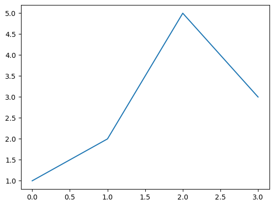
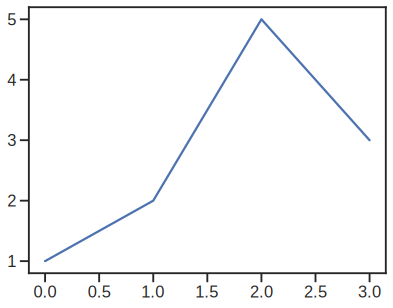

# A little snippet for nicer plots using matplotlib

If you've seen previous blog posts (or read any of our [group papers](https://scholar.google.com/citations?user=HeyhCHEAAAAJ)) you may have noticed the plots have a consistent look.


```python
import seaborn as sns
from matplotlib import pyplot as plt
```

The default matplotlib look


```python
plt.plot([1,2,5,3])
```


    [<matplotlib.lines.Line2D at 0x11530e960>]


    

    


Not bad but try the following now


```python
from matplotlib_inline.backend_inline import set_matplotlib_formats
set_matplotlib_formats('svg')

sns.set_theme('talk', 'ticks', font='Arial', font_scale=1.0, rc={'svg.fonttype': 'none'})
```


```python
plt.plot([1,2,5,3])
```


    [<matplotlib.lines.Line2D at 0x1154e8ce0>]


    

    


An added perk is that the plot is now embedded in your notebook as SVG so if you export to Markdown/HTML they will stay nice and crisp.

**Bonus:** If you're a marimo user (and if you're reading this you *have to* try it), it's even easier:


```python
import seaborn as sns

sns.set_theme(
    context="notebook",
    style="ticks",
    font="Inter",
    rc={"svg.fonttype": "none", "savefig.format": "svg"},
)
```

This has the unintended consequence of making all figures fill up the available space. There's a little trick to keep things just the right size:


```python
import marimo as mo

def fig(f):
    return mo.as_html(f).style({"width": "max-content", "display": "block"})

fig(plt.gcf())
```

This is a Jupyter notebook so I can't show you the output but trust me, it looks good.
