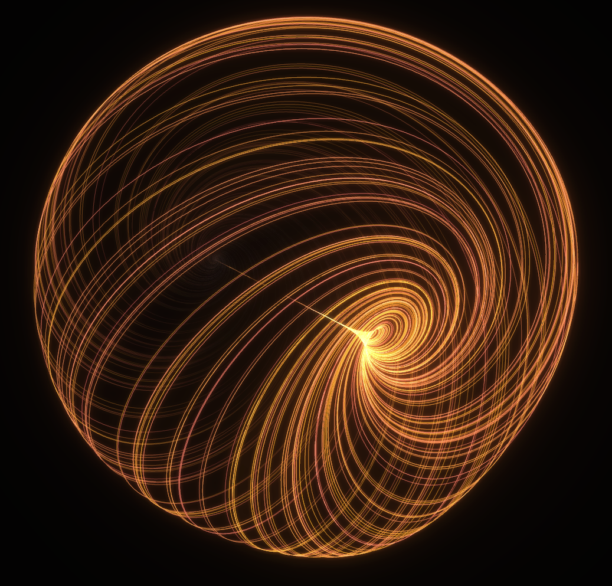

# Nice strange attractor visualisation
{.hero}

[Zensical](https://zensical.org/) is a new static site generator implemented in Python that I heard mentioned on the *Talk Python to Me* podcast. The website features a stunning mathematical visualisation that I was able to extract into a GitHub pages [website](https://hessammehr.github.io/attractor), using Claude Opus 4.6 (low) via [Pi](https://github.com/badlogic/pi-mono). The parameters involved in the differential equation can be modified and the default flythrough effect can be interrupted to allow zooming/panning/rotating to explore the geometry.