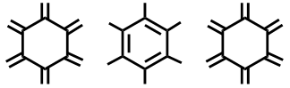

# Chemistry ⟷ Information ⟷ Discovery
## S. Hessam M. Mehr

 Leverhulme Early Career Research Fellow, University of Glasgow 

 [CV] [Blog] [GitHub] [Twitter/X] [Email] [Group website] 

{.logo}

Investigating information and automation as gateways to new discovery paradigms in chemistry.

### Writing and projects
- [Mehr Research blog][group_blog] My group's blog, featuring posts by current and past members
- [0101chem] companion website to my *Digital chemistry for digital natives* outreach project, funded by the [Royal Society of Chemistry][RSC]
- _[Sound Chemistry]_ Royal Society of Edinburgh workshop that I organised in March 2024 with a focus on novel modalities for chemical containers, e.g. acoustic confinement
- [Personal blog][Blog] Personal takes and hobby project covering chemistry, programming and electronics ([RSS feed](/feed.xml))

### Publications
For more context on current research projects and related publications see my [group's research page](https://mehr-research.science/research/#publications) or my [CV][CV publications]. For a complete list see [my Google Scholar][Google Scholar] or [ORCiD profile][ORCiD].

### Recorded talks
- [Building robot chemists with micro:bit][talk:microbit]   Lightning talk, _micro:bit LIVE_, **2021**
- [A lingua franca for robot chemists][talk:scotchem] (slides)   _ScotCHEM Early Career Research Seminar_, **2020**
- [An alcohol? What are the chances? Knowledge-based and probabilistic models in chemistry][talk:pymcon]   _PyMCon_, **2020**
- [Saving lives with Julia][talk:julia]   _JuliaCon_, **2018**

### Code
For an up-to-date list check out my [personal projects](https://github.com/hessammehr) and my [research group's projects](https://github.com/MehrResearch) on GitHub.

- [FemtoEdit] A minimal, keyboard-first WYSIWYG editor for web pages
- [microbit_sensornet] Browser dashboard and [accompanying MakeCode sketch][microbit_sensornet_sketch] for aggregating sensor readings from a swarm of micro:bits over Web Bluetooth
- [RecursiveMA] Algorithm for inferring the complexity of a given molecule from tandem mass spectrometry (MS2, MS3, ...) data
- [Delphi] A standard interface for storing, sampling/fitting, and comparing probabilistic models for interpreting scientific experiments
- [XDL] A hardware-independent chemical programming language ([see publication][10.1126/science.abc2986])
- [Logic.jl] Early sketch of a typed logic programming system embedded in Julia
- [liquid_rules] (Prolog) and [liquid_rules_ddlog] (Differential Datalog) Proof-of-concept declarative scheduler for robotic liquid handling
- [coalescence] Demonstration of peak coalescence in NMR ([source code][coalescence code]) (JS)
- [molsketch-cljs] Cross-platfrom 2D molecular structure drawing program (ClojureScript)
- [NMR.jl] Processing, visualization and analysis of NMR spectra (Julia)
- [pyMPB] Python interface to MIT Photonic Bands (MPB) 
- [SolidStateNMR.jl] Simulation of solid-state NMR spectra from calculated shielding matrix
- [vim-gaussian] Gaussian syntax highlighting for vim
- [XRD.jl] Utility functions for X-ray diffraction (Julia)

### Opportunities
I am always keen to welcome motivated individuals from a range of technical backgrounds into the group. Please refer to the [my group's website](https://mehr-research.science/opportunities-engagement/) for a list of current opportunities.

[CV]: CV.html
[CV publications]: CV.html#publications
[CV PDF]: https://drive.google.com/u/0/uc?id=16xHJQQshijyGfEfSn_kpNxpLe9xHZPfx
[Blog]: blog
[GitHub]: https://github.com/hessammehr
[Twitter/X]: https://twitter.com/hessammehr
[Email]: mailto:Hessam.Mehr@glasgow.ac.uk
[Group website]: https://mehr-research.science
[Google Scholar]: https://scholar.google.com/citations?user=HeyhCHEAAAAJ
[ORCiD]: https://orcid.org/0000-0001-7710-3102
[0101chem]: https://0101chem.science
[Sound Chemistry]: https://sound-chemistry.science/
[RSC]: https://www.rsc.org
[Logic.jl]: https://github.com/hessammehr/Logic.jl
[coalescence]: https://hessammehr.github.io/coalescence
[coalescence code]: https://github.com/hessammehr/coalescence
[FemtoEdit]: https://github.com/hessammehr/femto_edit
[liquid_rules]: https://github.com/hessammehr/liquid_rules
[liquid_rules_ddlog]: https://github.com/hessammehr/liquid_rules_ddlog
[microbit_sensornet]: https://github.com/MehrResearch/microbit_sensornet
[microbit_sensornet_sketch]: https://makecode.microbit.org/05783-02185-24551-63527
[RecursiveMA]: https://github.com/hessammehr/recursiveMA
[Delphi]: https://github.com/hessammehr/Delphi
[group_blog]: https://mehr-research.science/archives
[molsketch-cljs]: https://github.com/hessammehr/molsketch-cljs
[NMR.jl]: https://github.com/hessammehr/NMR.jl
[pyMPB]: https://github.com/hessammehr/pyMPB 
[SolidStateNMR.jl]: https://github.com/hessammehr/SolidStateNMR.jl
[talk:julia]: https://www.youtube.com/watch?v=QhPdqUG2mRg
[talk:microbit]: https://www.youtube.com/watch?v=LdGD7-9-e5A
[talk:pymcon]: https://www.youtube.com/watch?v=q8n8XD-cB90
[talk:scotchem]: https://drive.google.com/u/0/uc?export=download&id=1I7gghfB4_kOd7AKrNqMFcO9DsrId9hpp
[vim-gaussian]: https://github.com/hessammehr/vim-gaussian
[XDL]: https://gitlab.com/croningroup/chemputer/xdl
[XRD.jl]: https://github.com/hessammehr/XRD.jl
