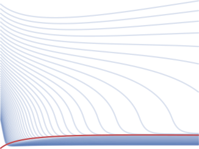
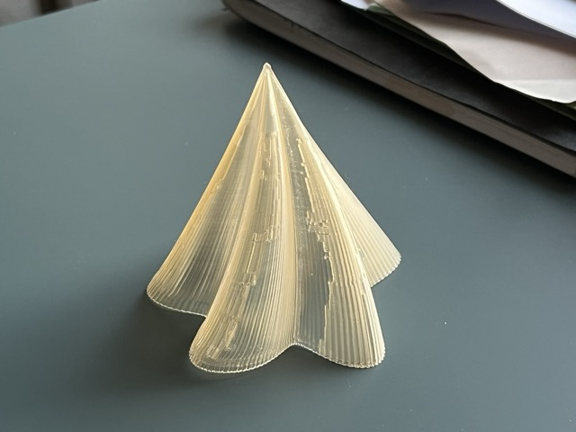

# Chemistry ⟷ Information ⟷ Discovery
## Hessam Mehr

 Lecturer in Chemistry and AI for Science, King's College London 

 [CV] [Blog] [GitHub] [LinkedIn] [Email] [Group website] 

{.logo .dark}

Investigating information, automation and AI as gateways to new discovery paradigms in chemistry.

### Writing and projects
- [Mehr Research blog][group_blog] My research group's weblog, featuring posts by current and past members
- [Personal blog][Blog] Personal takes and hobby projects covering chemistry, probability, programming and electronics ([Atom feed](/feed.xml))
- [0101chem] companion website to my *Digital chemistry for digital natives* outreach project, funded by the [Royal Society of Chemistry][RSC]
- _[Sound Chemistry]_ Royal Society of Edinburgh workshop that I organised in March 2024 with a focus on novel modalities for chemical containers, e.g. acoustic confinement

{.dark}

### Publications
For more context on current research projects and related publications see my [group's research page](https://mehr-research.science/research/#publications) or my [CV][CV publications]. For a complete list see [my Google Scholar][Google Scholar] or [ORCiD profile][ORCiD].

### Recorded talks
- [Building robot chemists with micro:bit][talk:microbit]   Lightning talk, _micro:bit LIVE_, **2021**
- [A lingua franca for robot chemists][talk:scotchem] (slides)   _ScotCHEM Early Career Research Seminar_, **2020**
- [An alcohol? What are the chances? Knowledge-based and probabilistic models in chemistry][talk:pymcon]   _PyMCon_, **2020**
- [Saving lives with Julia][talk:julia]   _JuliaCon_, **2018**

{.hero}

### Code
For an up-to-date list check out my [personal projects](https://github.com/hessammehr) and my [research group's projects](https://github.com/MehrResearch) on GitHub. The following are a mix of hobby and academic projects.

- [labctl] A tiny, no nonsense Python library for controlling our lab instruments
- [advion_io] Pure Python library for communicating with Advion mass spectrometers
- [Ctrlaer] Micropython library for real-time pulse generation on the Raspberry Pi Pico/Pico 2 using PIO
- [AeroBoard] Raspberry Pi Pico-powered circuit board
- [UEFib] Boot to fibonacci: Bare metal fibonacci number calculator on using UEFI
- [3D-printed mathematical lampshades] ([Live marimo notebook]) 
- [FemtoEdit] A minimal, keyboard-first WYSIWYG editor for web pages
- [microbit_sensornet] Browser dashboard and [accompanying MakeCode sketch][microbit_sensornet_sketch] for aggregating sensor readings from a swarm of micro:bits over Web Bluetooth
- [RecursiveMA] Algorithm for inferring the complexity of a given molecule from tandem mass spectrometry (MS2, MS3, ...) data
- [Delphi] A standard interface for storing, sampling/fitting, and comparing probabilistic models for interpreting scientific experiments
- [XDL] A hardware-independent chemical programming language ([see publication][10.1126/science.abc2986])
- [Logic.jl] Early sketch of a typed logic programming system embedded in Julia
- [liquid_rules] (Prolog) and [liquid_rules_ddlog] (Differential Datalog) Proof-of-concept declarative scheduler for robotic liquid handling
- [coalescence] Demonstration of peak coalescence in NMR ([source code][coalescence code]) (JS)
- [molsketch-cljs] Cross-platfrom 2D molecular structure drawing program (ClojureScript)
- [NMR.jl] Processing, visualization and analysis of NMR spectra (Julia)
- [pyMPB] Python interface to MIT Photonic Bands (MPB) 
- [SolidStateNMR.jl] Simulation of solid-state NMR spectra from calculated shielding matrix
- [vim-gaussian] Gaussian syntax highlighting for vim
- [XRD.jl] Utility functions for X-ray diffraction (Julia)

### Opportunities
I am always keen to welcome motivated individuals from a range of technical backgrounds to the group. Please refer to [my group's website](https://mehr-research.science/opportunities-engagement/) for a list of current opportunities.

[CV]: CV.html
[CV publications]: CV.html#publications
[CV PDF]: https://drive.google.com/u/0/uc?id=16xHJQQshijyGfEfSn_kpNxpLe9xHZPfx
[Blog]: blog
[GitHub]: https://github.com/hessammehr
[LinkedIn]: http://linkedin.com/in/hessammehr
[Email]: mailto:Hessam.Mehr@glasgow.ac.uk
[Group website]: https://mehr-research.science
[Google Scholar]: https://scholar.google.com/citations?user=HeyhCHEAAAAJ
[ORCiD]: https://orcid.org/0000-0001-7710-3102
[0101chem]: https://0101chem.science
[Sound Chemistry]: https://sound-chemistry.science/
[RSC]: https://www.rsc.org
[3D-printed mathematical lampshades]: https://github.com/hessammehr/lampshades
[Live marimo notebook]: https://marimo.app/#code/JYWwDg9gTgLgBCAhlUEBQaD6mDmBTAOzykRjwBNMB3YGACzgF44AiABgDoBGADg4BYWaRGDBMEyVBwCCogBQBKDGgACIsBwDGeADY605PADM4mRQC40ca3FCRYcKHis270eAQCu4AJ5xEAM5wBGAu1m4OAB4gOhx4ME54HACiOngghDAAKon+QclZYXBGUBAgcAF0Iro+HPhl8VB+EfAAChA6PjgQBEUtcAmgeJV94O7B8VTQANaRo-bwAZrAYD7z4wF4iABG0AR5FQQBGDbFpeVIMGA6EDA6wNu2Yw6r17cH1zDrDkgoIBAHf4nGwBI4cTYwTD0dJ4OQsGCIHTTFgAGlYMGAmmmAVRxR6MEYLGkKERuKM+MwS0ReEYXA4bDRUE0jAA3iwAgA3HAcckEGAwHxgPAscysAg9YUAXyUpycME8UH2BTR7U63QIaP+aJCaM+jLwaMGGRGGDUoi0un0hhMZi1wTAup0MAUllO1sccmhCJdRVOAGJHIAQAkYgc0EACgDACOQAVkAHcAKQCgBABqBOcABMYcjcgAnPHk6n6dHM1G02w2HmU-xfTY5Qr9iEtOGY3AAFQDOjxRAKOBJuDp1v2xsBHMDr1dnt9wsDhuZuSltijjveif8enKN3GOBgUpGYBpOTkH2nU4sABK8TrQWhFU01OKiE0MGgeKgcB0iB8xDgVA7Tjg5FsIJxSgJB7k2ADyGAAIEQIbQBgBJ8xAgExKmqDghGPGsL0VQcAgAR1gA9uzbOR+17BsdmHMjJ2jacNACYACAPOiODAYAFA49cbDHIJmAokgCHwUi0TTFi2LRTg2C4GUbHIXjB3uI4wAfWEGTgLg0S4MsZOsKB5KgT0l0CHS4EifSgjbGcmx4kyfHMliGKYmyikiOzxAbaCH2mOQAG0zLROyAF00UQSIoMYABaaSiiMNE5EQDT-DTbtmE+cFPG2N4YGHWCOgCRg0zRXccAYgAvGkczRfhONOBLWJuGA5H8uA7JMxA03q24DwCXUdz3WE5Jqmx-g4cBYkYsgSEfYAOVhNKcE0IxFBM2scO3ZD+rRVzjlNdQLT0AxNzMZV7X1I9ZM3G5EEoTkcEwZT6HuiAJuHW77tIOhRWgqBuwigA+QcCHIZASB8V1MNYFgMIh5JIgSB9svbPBimAPSPB6CL0jAAU4AAHgehhyEJDgSZYAHECBxxsKOfx9jkAA5FFkv8KBQeraxkLgAANABNLdnr5IJGLgABlAA1ABxOBPE2V9PAIWgAg4dm4GkAIAm8YYka3D7AP8HQnGuvxIKWOUoIoOA5AaoJOYAGTgMMQCQIGAgUNEf0xBhLk0Dsgh8CAFRRtJlYhyHocw0p3mYApWOQTY5DegmFDqRoIC6pQVYA5h6YlFXyVfXRbH2SOYA4WhiAsFXTmAExdA4BFuQCa5aDhSUWAUHyosCphmBYAmRSriHb0p5g69IQZthTxqWHIXEoZM0Pq5MNImOHw84ABthwcXxes4dinyEHnftkN6YVZr-89Zzoht8XkhzbgMXEU8PBklZ6A4Rz4IMaxnH8d1omAByEmHBAEA3JPLACwtrziwluhDOocAyw3ho+fWOhgjeG2MQAIABubWu40h6xYAAWVMi1OA9tIjkMoeQkBuIAgAi8BkFAmgKgJC2OUKCpkGQ+AZJEDSPgNIgJVkw+SYFGpIDAHIIwV0YD6h5IxYGeg5BQBYJ3JMgUAD8AAdcgLZtEcF0UmAAPuorRRjcSHiGphC+K85CiO7AAUjgKJAAhMwLeR9HCIAfk-HQL836lAMiwAA8uQACTCsGvk5mGaAkECCkC1ngOGU0yAARKGUUWksdb0HgSrbG8l+Kg3sd4Hq-4BRCkYDIiApBk5OFQkKOQUURIIIhgGc8-xZoOx6JsTQngMRdPIJ4Zut4yBBAPlTTpyNkkjNoA7G4jkcD8wmrYEw25hiZEzjXIwhSNCKURNyYCIB7EaEgkYJaBSQphXymwN2-hrm0gXjYaYeA8BiD4hoOgnksS+R8jkF+wV-zbKCADLgeAIrZkCk86wBTxAFJ8i8t5gVz4mAbPsnQhzoDHPhWwbuEUtzZU7lwKFeN1LguzLfUOsLUqEvMF3YEEdqYEuOLKamygzQaG0Add0ZhVRdB6NqB0W4+ppENH8YYdAtqtVvu6SAaoeiYGQFsTA2g+SlGAOQOQBTRQNiBiDD8v0AbymuHgHy1TSCCo4Hq1mH5AqUpsFQmlAQfLmAksi0OfgnUus0u6iG-D3IaFKMoyIaIorQpalwANHAg06DkD4UN0VQ6IHEJwWill6LeCagOQRcB8X+rbD4cNmhHWWzpAuAA9JbAAbPSAcXZiK4UzVm3s-CG1ZoLZGvNkaC3WOPJoT1pba2VrkDWhcbZ60OSbX4Xsgi21UI7bm0y3aWq9tZfKHCiBLX6p8L5YtaJ+2AvIBUmk5rnRcWsO6epiAxp4BVQsigT1OiKTmtlHVGhrWg21KKCahrAbAxtWDFWUNw7HgAKoK3zuUZAmgV44HoFTAI17m6CTgJzZNMHwwWzlT4Z9IcIbastozZmNB6AB3gEMkZiSAKEAApACaeHMLnnXTTexTNk5AahirAMmwcAZD5G+QgcGvkqx41G9FmKQInI4GcpaDYOTfO8j5S5zKfK4qhVc8KtyNP5UTRDXZHAvkIh+T5VT9JAUzlKZmnjCgoUqyfAidBzBnX0tDgiKA+B4AfI4IpJuKlSL0kNLcRE2oJzSRdfSrjRdJpysSfrHoSzrzYefSrMjUbf47tYy4u5R7BQntkeGgAVim-J2U72Yb3nJhTvllM4sCrZ0O+dbCGiLnAQgmsSBkE9MgDz50d4e0IeKeACcfIFe7rjZg8BcYVBG6FqF9qd5FaTMwLgXil5wCK39ZgdjrPzZ3jYIrW3CAJzwDgX66lVsQxPlsM+e3pbiE9Iu51o3uzDqe7Nx7I3u69jBVFaM4bThkZ8sAbuzA5Cdulg2gpZXwKfYnJ4AcUOMMw8W+pX1jLmOof6ee-8m5SgIjIJgVyTUwZ-u3YaIyopT2-t1f+0Gu3NBon07OMcdyPKMUMp2cNp4o3bt+Qz3NARAU+TKZoOraIcuVKpyrVa+xXJwBUHAU8HBCgMpxyYGANBoIPsqJaTAxo6ByBS-04ghOSc07J+fAgRAoCm7fVa2nH44DGLgNfA0KsOzABwHQSETtKeyJRCIzA75Px6W-XyAPrmgs6ChJryEJByB+5qXIoov6jQSuV+Kyou3gMqwloQYgiTxnfkSbAT33uEASt2-isjX4NZQCMCpL6RmXkATx1RxwjESrdKt3gR8Ftth+Dwp4a6QRPQkkEp4d8aTw3V+xsAHoiIi7W4qAqBvcEVF4FmnpZG0BgCZFIPPgg3YJnQVoD7C2fxxnwEQuW3Y-Iyiq4B8bm3cuJmMWt6blmyMGZsZZqDMpdg9wywdwfgSOFA+6mQTgAEOwqWwktyDGx4OemcuOnemAW+GI2gw460BCt6rkduH6BquaAM5uAGu2pw9McKIquBtQDSpquKXipCfEQeH42CXipU+mPmyk2g-makHuXuPuIAaIxC-23ERkHBjEvm3BkkgWDmMeUEce10QhIh1g6B+m6WcgcgpCbYjMcAAAzNlselUvll4o1sAHFKVOTt2MLG1swoknIKVCsPYWUjZL1rdkCp5LBMjKDqQvisAIutJHAMOj4epMoceK5JgHjuIG3gTkTtgf1KbpYRdiocQISn4doXAKKHIH4d9g2joVvGmCDqZD4BEe8G2HEfuCbDBNoKEacKoUDgOBQZkdkSEQ0SJIUaVF4jLnAKoY-hdChBqremvsMAzGHnInAMQqMWiMhDsvEJMcUPcGAKKLsB0L+uIj5GsRNHVmQTYEMfJD5GjovKYS1gJEJMEdJNsZhNsIEHgAuMwNMRCBOGkS7kkXAFcZsJGncecg8b2FkaFrkS8Y1kVsLCcbCPTK4W4ftvsKDijgEc4vTC8bVOIG8TcROAVgiTYI8MwMiQuL2AVr0BCZhKwlidcZGrifiQSW6EiSSaieieEKiu8DIisBcW4bsRwOoDRr5Juq8fuvVhSRDKyeyUDJyfuuLryXya1joJsMybdgGE4FvpsN+Iop3rSceAKaIByT5FyfztsGKeKTsSpErIKZqpqeLjyaEV0bsb0RzM-p-l5oELzjXi-vGuUrlkYUnuGhQXcTaa5OCFUEKKpgcacIwcEMwSHjtKHKoZgI6VEagegZiMMY6abuGrseIAxIYJgLsQzIwDocQowMQlMV8fEIwGpIyWAIwAAGKIibDhqqHiCRmOlWmrJL4m5y5cKDYu4SjMnv4tkDoUSIYAZZE95Oni6GFS63YXzdlOm+nVABlwDuIu7Sk1g+IKl+IBLvzBIACSQ5tMAE0Z5RWsIAMs8AVQXS14iGGQyy-GYY8s8AiARgk0CGSGik3I7cXikZk5MZgkaBKR8Zw4k5SZjZAOhZkIH5h2TEqhoRtZXm8mzevkqhaI75Q5upDWBpPYTmAxGZBpWZOZeZBZMxBI9x8QmAk5RUCxjA-yeArSO83GGIMAPsrxtwT45QfwlspUxZLomOD5KAKGC4T4zZr43FSybAJhz4QJxcFMQkYJi51geJ92MJTizxFJEAtx62LxEAHx625JEJwAKlhFIF25uJLxwAGlelxFBlmlAJBpbJ6pQpPkylaIxlDluKNR+pmB1lQotl9lqGiUxltmXiNFZ+DAiEHe5Q9hjAAAEhxdGYJeMVFPBPxR3ihsQlFF4ohFGc-vdmcf8bdmlaBahsBWZcvj8VlQ0SJa+GJd4oJKCeCXtrJdCX8XAHCWpSpWldGYZUpRpa1RlWSUZS1RAGAIVV+O1QScZeILleZXiZZW5Uab5F5TpQ5cSi5dYGqR5caXNYlOpX5aHPrmNZnnQBnkMJUHIHGZgYwPBfeKdUUh+NIgaSOa6T+r1BAJgflJWZKZRSrPrqNMQPgN+aXpgYoB9enruJEJgEclWQDdtenutM9cdYiBqokuRVAC-OGl0frtju6EgOzjVdYInLrL3IYAEP8AEBFDgCQGAPtbdEIJFhFDTdLLLDrCQBkJNEEDTRFO7ngGXgIeIPOGuJHrIRrvIVCJeCmtwIHsHtguIFpAuHAAGIxJoIbAqY1oTWnNCK+ALdBHgoYPLVsIrc+EYHgFQF+IMBJWkCyhDAQPdFQU9C9OINGGWNYAGGGGqnlB3qIIQruIYPcDjBMsbYJIQteXyHZt1kRYmZBNevECbk7NzaWLWjLTeHeDAtknxfQFwiEgACIqxUCIjR4p1YhEDqx67lDLYcCiRx0PGu4vj+AVCd6EJ15DEqwFYCyUgCiELMCl0BhcCMClCQIiSMAgC0BOBoi6GMBYKzToJyAix+k1BUXHgBis1vg1IAQABkDskByM+5uaNNKsSqWpkBz0e82G6oiqhsKqe9GqxOrsJW8k20i6qqCQ+9jZSCRwCoO+GVh9PQesAAwp-QAOqV1O0MRa78Zg2Skopf7JpTaeK3bUoqbmB0rEqNirAA3U201UiELJ3B3kbADh0Pms3S5RpICRBSbiZWpYparZTaaPLhpoNeGWypqjiYPpWTSYBh1M2R0gAvaOBX2thOa3hpCP2b34pXo3rxVO333oJ0ZXkBz8Z4OhzRnMDCMmrQ4PpJaMQvplIW37nW2Cwz3VzbnZy5yhwXxZ16BQh0CYjTD50BCF16ztkV0TImM53mN53DDWNR2bzMnYbiB8rqhyCOmhEBiT3VCdCvGeDnJfgkYMBEA4AH6DLyEUxwTa2F60xFxZ1QC7nAUIFGNDmPoDrYYcDbBhP60GQRSONmMWNWOF1oiN2MTN04Y0g1MW3QT1O6MQwTk5P5NQSYDpbSXeK+LPyvzrlwhblpMZP4XdJ6AiDgTaz7l4JQGeBwRlO52WOuM2PPgMRjQ1x+DXhka4avn+VwAbkmCFPhMCXUxBCHlOgrCELv1HCGiIAvLazvjubDDwAD7gNZNtMmD-n5P1AgBQi5Y9ysDEKT4Yg+M9ADwUk-MdADqEODkf6-N4BlBlIvI+CMDvggDbDAxwA4Cijcg72tM2I5OxLpP6a87QudBxBwzEDz5QCNhxLOrwOHqjn5YO3-ilBiAUZAHt5I4v0HOKOEIfl8XewMCSPwAB1fDjn6OPk3rKOUCqNEDwsm4ktyTaiW0bRpDaPZSEvwT82x4RHXTc21rpqsRPH2aIhyHQRC2Khm2YQ7UTax7a4dimP66G63aJmuSMCOkR57b-meskVeJ8He6F2MBBsCE+s7wW3i16SMBRssF6QRuLzms536vx6MDJuWsKHkCJunA6vbgTRwg-0l4Yj8HmC4ifVdNZ2TQlve7hr5t8hwg5DYN+3DBltoh2KfW7GrpYQY5o1rp1iWyY0agZyqB7RcpWhHRyBDuagQCuH2sSBY1FDbAwBQkIAQAcCeDAAFP9JPhMTvhYI6CEgiyIBdIixZC2y4gKowYWPovXpYvJqYCiifUzLuBwgYtgCoSGDgh3DtwrRMrLsagV4mijvmjjuHQ2hyAAeagSoztzvrswVeS+SfWVAQBUCKBogAe6ky7spjuWjgemCVz9uKjKAXzYAJIZDYBAssDYBDvYCQs2B7RI1MRKBAA
[advion_io]: https://github.com/MehrResearch/advion_io
[coalescence]: https://hessammehr.github.io/coalescence
[coalescence code]: https://github.com/hessammehr/coalescence
[FemtoEdit]: https://github.com/hessammehr/femto_edit
[labctl]: https://github.com/MehrResearch/labctl
[liquid_rules]: https://github.com/hessammehr/liquid_rules
[liquid_rules_ddlog]: https://github.com/hessammehr/liquid_rules_ddlog
[Logic.jl]: https://github.com/hessammehr/Logic.jl
[microbit_sensornet]: https://github.com/MehrResearch/microbit_sensornet
[microbit_sensornet_sketch]: https://makecode.microbit.org/05783-02185-24551-63527
[RecursiveMA]: https://github.com/hessammehr/recursiveMA
[Delphi]: https://github.com/hessammehr/Delphi
[group_blog]: https://mehr-research.science/archives
[molsketch-cljs]: https://github.com/hessammehr/molsketch-cljs
[NMR.jl]: https://github.com/hessammehr/NMR.jl
[pyMPB]: https://github.com/hessammehr/pyMPB 
[SolidStateNMR.jl]: https://github.com/hessammehr/SolidStateNMR.jl
[talk:julia]: https://www.youtube.com/watch?v=QhPdqUG2mRg
[talk:microbit]: https://www.youtube.com/watch?v=LdGD7-9-e5A
[talk:pymcon]: https://www.youtube.com/watch?v=q8n8XD-cB90
[talk:scotchem]: https://drive.google.com/u/0/uc?export=download&id=1I7gghfB4_kOd7AKrNqMFcO9DsrId9hpp
[UEFib]: https://github.com/hessammehr/UEFib
[vim-gaussian]: https://github.com/hessammehr/vim-gaussian
[XDL]: https://gitlab.com/croningroup/chemputer/xdl
[XRD.jl]: https://github.com/hessammehr/XRD.jl
